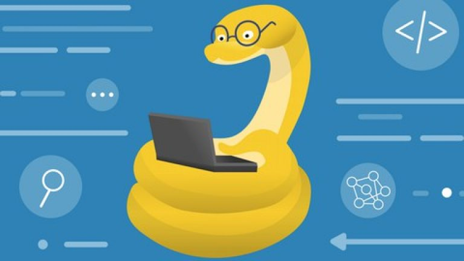

# <i>Погружение в Python!
# Home work 10 - ООП начало

# Задание:</i>
>2. Доработаем задачи 5-6.
 (Задание №5: 
 Создайте три (или более) отдельных классов животных.
Например рыбы, птицы и т.п.
У каждого класса должны быть как общие свойства,
например имя, так и специфичные для класса.
Для каждого класса создайте метод, выводящий
информацию специфичную для данного класса. 
 Задание №6:
 Доработайте задачу 5: Вынесите общие свойства и методы классов в класс
Животное.
Остальные классы наследуйте от него.
Убедитесь, что в созданные ранее классы внесены правки)

- Создайте класс-фабрику. 
-Класс принимает тип животного (название одного из созданных классов) 
и параметры для этого типа. 
- Внутри класса создайте экземпляр на основе переданного типа
- Верните его из класса-фабрики.

>3. Возьмите 1-3 любые задачи из прошлых семинаров (например сериализация 
данных), которые вы уже решали. 
- Превратите функции в методы класса, а 
параметры в свойства. 
- Задачи должны решаться через вызов методов 
экземпляра. 
